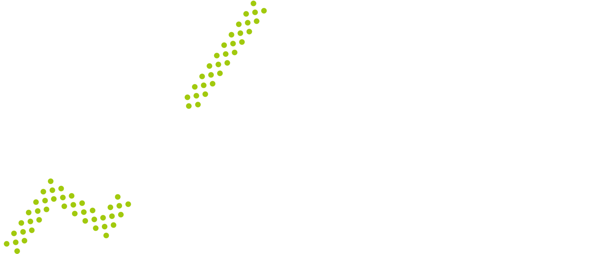

# Overview

<figure><figcaption></figcaption></figure>

## <mark style="color:green;">What is AlphaPilot?</mark>

AlphaPilot is an AI-driven quantitative trading ecosystem designed to empower traders of all levels. Built by experts from leading global tech companies and top institutions, our mission is to help you achieve financial freedom through cutting-edge AI and quantitative trading technologies.

## 🔑 <mark style="color:green;">AlphaPilot Ecosystem</mark>

<table data-view="cards"><thead><tr><th></th><th></th><th data-hidden data-card-cover data-type="files"></th><th data-hidden></th><th data-hidden data-card-target data-type="content-ref"></th></tr></thead><tbody><tr><td><mark style="background-color:green;"><strong>1 APilot</strong></mark> </td><td>
APilot is an open-source, high-performance trading framework focused on cryptocurrency and stock markets. It supports both backtesting and live trading, providing a complete solution for professional and retail traders.
<ul><li>Event-Driven Architecture</li><li>Multiple Trading Strategies</li><li>Professional Execution Algorithms</li><li>Comprehensive Backtesting</li><li>Multi-Exchange Support</li><li>Live Trading Ready</li><li>Extensible Design</li></ul>

</td><td></td><td></td><td></td></tr><tr><td><mark style="background-color:green;"><strong>2</strong><strong> </strong><strong>Trading Agent</strong></mark></td><td>
A smart assistant that enhances your trading with real-time market analysis and actionable insights. 
<ul><li>Smart trading recommendations</li><li>Intuitive conversational interface</li><li>Risk preference-based strategy suggestions</li></ul></td><td></td><td></td><td></td></tr><tr><td><mark style="background-color:green;"><strong>3 Strategy Signals</strong></mark></td><td>

Stay ahead of the market with real-time alerts.
<ul><li>High-probability trading signals</li><li>Opportunity identification across markets</li><li>Boosted trading efficiency</li></ul></td><td></td><td></td><td></td></tr></tbody></table>

## <mark style="color:green;">📊 Available Markets</mark>

* Cryptocurrency&#x20;
* US Stocks \[Coming Soon]&#x20;
* A-Shares \[Coming Soon]

## <mark style="color:green;">💡 Trading Strategies</mark>

* **Trend Master**: A deep learning-based trading strategy designed to capture key opportunities in your selected assets, providing precise <mark style="color:green;">buy and sell signals</mark>.
* **Symbol Advisor**: A strategy that delivers <mark style="color:green;">precise buy signals</mark>, enabling you to seize top market opportunities across <mark style="color:green;">380+ symbols</mark> with clarity and confidence.
* **SOL Scalper:** A <mark style="color:green;">short-term Solana trading strategy</mark>, leveraging trend, momentum, and volatility indicators to generate high-probability trade signals.

Whether you're a beginner or professional trader, AlphaPilot provides the tools and strategies you need for smarter trading decisions.

Ready to start your quantitative trading journey?



