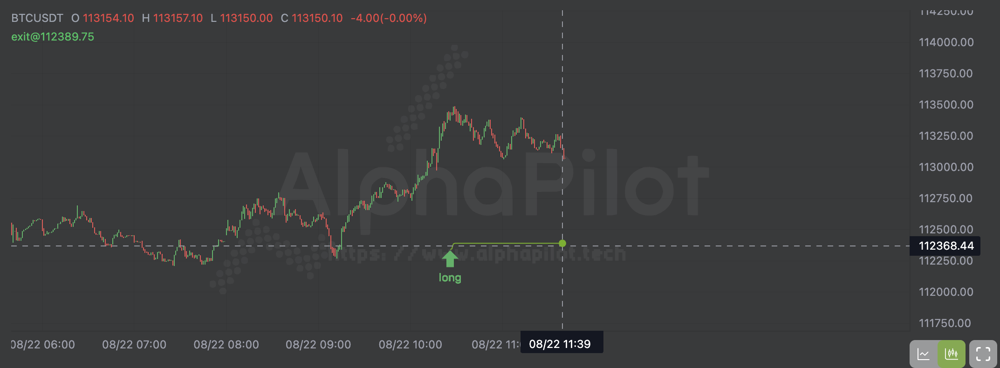

# Trading Education Hub

## <mark style="color:$success;">Ⅰ.</mark> <mark style="color:$success;"></mark><mark style="color:$success;">**multi-factor quantitative strategy**</mark>

AlphaPilot adopts a <mark style="color:$success;">**multi-factor quantitative strategy**</mark>, which is a very common approach in quantitative investing. The core idea is to <mark style="color:$success;">**simultaneously utilize multiple proven investment factors**</mark> to construct a portfolio, thereby improving the stability of returns and reducing the risk of a single factor failing.

#### <mark style="color:$success;">1.</mark> <mark style="color:$success;"></mark><mark style="color:$success;">**What is a “Factor”?**</mark>

In quantitative investing, a _factor_ is a characteristic variable used to explain or predict asset returns, typically extracted from financial data, market prices, or macroeconomic indicators.

* **Common Types of Factors**
  * **Value Factor**: e.g., low Price-to-Earnings ratio (PE), low Price-to-Book ratio (PB).
  * **Momentum Factor**: stocks with strong recent performance and upward trends.
  * **Quality Factor**: companies with high ROE, low leverage, and stable profitability.
  * **Volatility Factor**: stocks with low volatility, generally associated with lower risk.
  * **Size Factor**: excess return characteristics associated with small-cap or large-cap stocks.

#### <mark style="color:$success;">2.</mark> <mark style="color:$success;"></mark><mark style="color:$success;">**Why Use “Multi-Factor”?**</mark>

* A single factor may underperform or fail during certain periods (e.g., value stocks underperforming growth stocks in some years).
* Different factors perform differently under various market conditions.
* Combining multiple factors diversifies risk and enhances the long-term robustness of the strategy.\
  It’s like not putting all your eggs in one basket—using multiple stock selection criteria together.

#### <mark style="color:$success;">3.</mark> <mark style="color:$success;"></mark><mark style="color:$success;">**Process of Building a Multi-Factor Strategy**</mark>

1. **Factor Selection & Testing**
   * Select effective factors from historical data and perform significance tests (IC, t-statistics, etc.).
2. **Factor Standardization**
   * Since factors have different units of measurement, apply standardization (e.g., Z-score).
3. **Factor Weighting**
   * Assign equal weights, IC-based weights, or use machine learning methods for dynamic weighting.
4. **Stock Scoring & Ranking**
   * Calculate a composite score for each stock.
5. **Portfolio Construction & Rebalancing**
   * Select the top N stocks by score to form the portfolio, and rebalance periodically (e.g., monthly).

#### <mark style="color:$success;">4.</mark> <mark style="color:$success;"></mark><mark style="color:$success;">**Advantages**</mark>

* Reduces the risk of a single factor failing.
* Delivers more stable long-term returns.
* Can adapt to different market styles.

#### <mark style="color:$success;">5.</mark> <mark style="color:$success;"></mark><mark style="color:$success;">**Disadvantages**</mark>

* Factors may be highly correlated (multicollinearity), reducing diversification benefits.
* Data quality and factor stability are critical.
* Transaction costs and slippage may erode part of the returns.

***

## <mark style="color:$success;">II. What Is a MicroTrend?</mark>

#### <mark style="color:$success;">1.Meaning</mark>

Microtrending involves identifying and <mark style="color:$success;">capitalizing on tiny price trend changes</mark> over <mark style="color:$success;">a very short timescale</mark>, ranging from a few seconds to a few hours.

#### <mark style="color:$success;">2.Core Logic</mark>

Even in seemingly random market fluctuations, prices can exhibit brief, directional upward or downward momentum over extremely short periods. This slight inertia or reaction is typically driven by factors like order flow, market sentiment, news shocks, and market microstructure.

#### <mark style="color:$success;">3.Common Methods</mark>

* <mark style="color:$success;">Price Momentum:</mark> (Short-period moving averages, price slope, etc., which is the current method used by AlphaPilot)
* Sudden Volume Spikes
* Order Book Imbalance: (Behavior of limit orders and cancellations)
* High-Frequency Statistical Patterns: (Such as price breakthroughs of small ranges)

***

## <mark style="color:$success;">Ⅲ. How to understand strategy performance?</mark>

How do you really know if a trading strategy is any good? You need to look past a single impressive number and consider a set of key metrics. Think of these like the vitals a doctor checks during a physical—you need the full picture to get a clear diagnosis.

#### <mark style="color:$success;">The Five Vitals of a Strategy</mark>

These five metrics are the standard tools for evaluating a strategy's health. But remember, a good strategy doesn't ace every single one; it finds a healthy balance.

1. <mark style="color:$success;">**Annual Return**</mark>
   * What it is: The profit a strategy makes, annualized to a full year. This makes it easy to compare strategies that have been running for different lengths of time.
   * Why it matters: It's your top-line number—the most direct measure of a strategy's moneymaking ability.
   * The catch: A high annual return can be misleading. A strategy that doubles your money in three months might not be sustainable, and it could be taking on a ton of risk. Don't look at this number alone.
2. <mark style="color:$success;">**Win Rate**</mark>
   * What it is: The percentage of trades that are profitable.
   * Why it matters: It tells you how often your strategy "hits."
   * The catch: A high win rate doesn't guarantee a profitable strategy. A strategy that wins 90% of the time but loses a fortune on the other 10% of trades will still bleed money. Conversely, a strategy with a low win rate (say, 30%) can be very profitable if its winning trades are significantly larger than its losing trades.
3. <mark style="color:$success;">**Profit/Loss Ratio**</mark>
   * What it is: The average profit of your winning trades divided by the average loss of your losing trades.
   * Why it matters: This shows the potential upside of a winning trade versus the downside of a losing trade.
   * The catch: Win rate and profit/loss ratio work together like two sides of a coin. Strategies with a high win rate (like those focused on mean reversion) often have a low profit/loss ratio. Strategies that catch big trends tend to have a low win rate but a high profit/loss ratio.
4. <mark style="color:$success;">**Sharpe Ratio**</mark>
   * What it is: A measure of a strategy's risk-adjusted return. It tells you how much extra return you're getting for each unit of risk you're taking.
   * Why it matters: This is arguably the best single metric for gauging a strategy's quality. A higher Sharpe Ratio means you're getting better returns without taking on more volatility.
   * The catch: The Sharpe Ratio assumes a normal distribution of returns, which isn't always the case. It can be less reliable for strategies that have a lot of "tail risk," meaning they might have infrequent but massive losses.
5. <mark style="color:$success;">**Max Drawdown**</mark>
   * What it is: The largest drop in your account balance from a peak to a trough.
   * Why it matters: This is a crucial measure of risk and is often a deal-breaker for investors. It answers the question, "How bad can things get?"
   * The catch: Your personal tolerance for risk is key here. While a quantitative fund might demand a Max Drawdown below 20%, a retail investor might be willing to stomach a 40% drop. But be warned: a high drawdown can wipe you out if you don't survive the next market crash.

#### <mark style="color:$success;">The Big Picture: It's All About Balance</mark>

Evaluating a strategy is a holistic process. You can't just look at one number and make a decision.

* A strategy with a high annual return but a high Max Drawdown is an aggressive, high-risk strategy.
* One with a low Max Drawdown and a stable Sharpe Ratio is a more conservative, steady-performing strategy.

The real goal is to find a strategy where the risk and return are balanced to fit your personal financial goals and risk tolerance.

***

### <mark style="color:$success;">IV. Why We Use Dynamic</mark> <mark style="color:$success;"></mark><mark style="color:$success;">**stop-loss/take-profit**</mark>

#### <mark style="color:$success;">1. What Is Dynamic</mark> <mark style="color:$success;"></mark><mark style="color:$success;">**stop-loss/take-profit**</mark><mark style="color:$success;">?</mark>

A Dynamic **stop-loss/take-profit** is a dynamic mechanism that automatically adjusts with market price movements.

* When the price moves in your favor, the stop level trails upward (or downward for shorts), locking in unrealized gains.
* When the price moves against you, the stop level stays fixed until it is hit, then closes the position.

In short, it helps you **“lock in profits while letting them run.”**

#### <mark style="color:$success;">2. Why Use It?</mark>

Markets are highly dynamic—thousands of factors can influence price at any moment.\
A **static stop-loss/take-profit** only considers the entry point and ignores new market conditions.

Imagine this:\
You set a static stop-loss, and the price is about to hit it. Suddenly, major positive news drives the market sharply higher. A static stop would have stopped you out, making you miss the rally.\
Dynamic stops solve this by adapting to live market changes.

#### <mark style="color:$success;">3. How to Use It in AlphaPilot</mark>

1. When you receive a signal and place an order, **set your initial exit price** on the notification.
2. Open the **strategy detail page** in AlphaPilot.
3. On the chart, you’ll see a **green exit line**. This line automatically updates to show your latest dynamic stop level.

<figure><figcaption></figcaption></figure>

